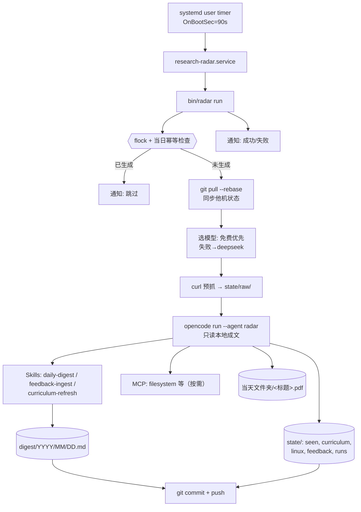

# Research Radar — 架构文档 (v0.1)

> 一句话：一个 **可迁移、多机同步、每日仅一次** 的科研雷达（模型默认 deepseek，可在 config 换成免费）。开机后自动用 **OpenCode** 抓取并汇总栏目内容，按 `年/月/日` 归档；带 **反馈闭环** 与 **KDE 桌面通知**；用 **Emacs** 看 Markdown/PDF。

- 状态：**已实现（阶段 0–7 完成；本文档随实现对齐）**
- 目标宿主：Arch + KDE Plasma 6 (Wayland)（主），未来迁移到其他机器
- 运行器：OpenCode v2.0.20（`opencode run` 无头模式）

---

## 1. 背景与用户画像

- **使用者是研究者 / 学生**：方向偏 **微调（fine-tuning） + RAG**，算力有限（**单卡消费级 GPU**，跑不了大参数量），后续**以编码器（encoder）研究为主**。
  > 完整的身份 / 方向 / 偏好写在**私有的 `profile.md`**（由 `profile.example.md` 复制），会注入选题提示，**不随公开仓发布**。
- 每天需要：跟上领域进展、补历史重要知识、补 Linux 系统知识。
- 已有环境：`github-project/` 目录（多项目）、`notify-send` / `kdialog` / `git` / `sqlite3` / `opencode` 就绪。

## 2. 目标 / 非目标

### 目标
- **G1** 每个自然日**只生成一份**日报，按 `digest/YYYY/MM/YYYY-MM-DD.md` 归档。
- **G2** 日报覆盖三类内容（见 §8）。
- **G3** **每日尽量不重复**；基于历史做**去重 + 轮换**。
- **G4** 支持**反馈**：对条目/主题/来源"喜欢/不喜欢/更多/更少/屏蔽"，并影响后续推荐。
- **G5** 运行完或出错时，用 **KDE 桌面通知**告知。
- **G6** 不用付费搜索 API；模型**默认 deepseek**，可在 `[models].order` 换成免费模型。
- **G7** 系统**可迁移**、**多主机数据同步**。
- **G8** 开机后自动执行（延迟启动，避开开机负载尖峰）。

### 非目标
- 不做全文精读/翻译；不训练模型；**不做 Web 界面**。
- **阅读方式是本地文件 + Emacs**：日报为 Markdown（`data/digest/`），选中的论文可下 PDF（**下到当天文件夹，标题命名**），用 Emacs（`doc-view`/`pdf-tools`）直接看。
- 不追求"绝对不重复"（免费源+随机性做不到 100%），只保证**去重 + 轮换策略**。

## 3. 需求清单

| 编号 | 需求 | 验收 |
|---|---|---|
| FR1 | 每日一份日报，年/月/日归档 | 同日重复运行不覆盖（除非 `--force`） |
| FR2 | 板块①微调/RAG 进展（最近 2–3 天） | ≥3 条新条目 |
| FR3 | 板块②历史领域知识 | ≥3 条，来自课程队列 |
| FR4 | 板块③Linux 知识 | ≥3 条，来自课程队列 |
| FR5 | 条目带稳定 ID，便于反馈 | 形如 `a1/b2/c3` |
| FR6 | 反馈入口（CLI + 行内 + opencode 命令） | 写入 `feedback.jsonl` |
| FR7 | 反馈影响后续推荐 | 排序权重/过滤/提示注入生效 |
| FR8 | 运行结束/失败 KDE 通知 | 成功与失败各一种文案 |
| FR9 | 模型默认 deepseek、可替换 | `[models].order` 有序尝试 |
| FR10 | 迁移到新机可复现 | `bin/radar-setup-host` 一键 |
| FR11 | 多主机状态同步 | git push/pull，冲突可解 |
| FR12 | 开机自动 | systemd user timer，`OnBootSec=90s` |
| FR13 | 本地阅读（Emacs） | Markdown 日报；选中论文可选下载 PDF |
| FR14 | 课程队列滚动更新 | 每 ≥7 天按学习进度刷新 |
| NFR1 | 每日仅一次 | 幂等 + 锁 |
| NFR2 | 免费模型不稳定时可降级 | 模型 fallback 链 |
| NFR3 | 无头运行（无人可点"允许"） | 权限预授权 |
| NFR4 | 可观测 | 日志 + `runs.jsonl` |
| NFR5 | 失败不致命 | 部分成功也产出/通知 |

## 4. 设计约束与关键取舍（Why）

1. **免费优先 ⇒ 放弃内置付费 `websearch`**。抓取改由 **runner 用 curl 预抓**（arXiv RSS / hf-mirror / HN API）到 `state/raw/`，**agent 只读本地文件成文**——比让模型联网更快、更稳、更省 token。→ `websearch: false`。
2. **免费模型会被限流/偶发失败 ⇒ 必须有 fallback 链**，按顺序换模型重试。
3. **无头运行没有"人工审批" ⇒ `radar` agent 必须预置 `allow` 规则**，否则工具调用会**卡住等批准**。
4. **多主机 ⇒ 数据放 git 仓库**；状态文件用 **JSONL（追加式）**降低合并冲突；密钥绝不入库。
5. **三类内容本质不同**：
   - 板块①是真·**新闻流**（抓取 → 去重 → 排序）。
   - 板块②③不是新闻，而是**课程/间隔重复**：一次性生成 backlog，之后按"到期"取，天然每天不同。**这是本项目的核心洞察。**

### 术语表（先把这几个词钉死）
- **backlog（待学队列）**：一份"**还没学、还没出题**"的主题清单——**不是新闻**，而是未来某天要出给你的**候选池**。板块②③各有一份，分别存在 `state/curriculum.jsonl`、`state/linux.jsonl`。它由模型在 M1 一次性生成（如"RAG 必读 40 概念""训练/部署必会 40 个 Linux 主题"）。
- **due（到期日）**：队列里某条目"**下次该被复习**"的日期。规则很简单：**`due <= 今天` 的条目，今天才会出现在日报里**。学过之后 `due` 往后推（例：1 → 3 → 7 → 16 天）。
- **间隔重复（spaced repetition）**：按遗忘曲线安排复习——越熟的间隔越长，只把"该复习的"拿出来。**这正是"每天不同"的机制来源**，而不是随机抽。
- **seen（去重台账）**：所有**曾经出现过**的条目，用于下次过滤，避免重复。
- **滚动更新（rolling refresh）**：课程队列**不是一次写死**——**每周按你的学习进度刷新**：学会的归档、按难度递进补充新主题、重排 `due`。

## 5. 总体架构



组件职责：

| 组件 | 职责 |
|---|---|
| **Scheduler** | systemd user timer/service，开机 90s 后触发，一天一次 |
| **Runner** `bin/radar` | 锁、幂等、同步、模型 fallback、调用 opencode、提交、通知 |
| **Agent** `radar` | OpenCode agent，编排 skills 与工具 |
| **Skills** | 可复用指令：抓取/分类/去重/成文/反馈 |
| **Sources** | webfetch + MCP（全免费） |
| **State** | seen / curriculum / linux / feedback / runs |
| **Digest** | Markdown 归档 |
| **Notifier** | `notify-send` / `kdialog` |
| **Sync** | git（GitHub remote） |

## 6. 目录结构

```
github-project/research-radar/
├── ARCHITECTURE.md              # 本文档
├── PLAN.md                      # 分阶段实施计划
├── README.md
├── config.toml                  # ★ 本地配置（gitignore；由 example 复制）
├── config.example.toml          # 配置模板（随代码开源发布）
├── profile.md                   # ★ 用户画像（注入 prompt；gitignore）
├── profile.example.md           # 画像模板
├── bin/
│   ├── radar                    # 入口：run [--date | --dry-run | --no-fetch]
│   ├── radar-config             # 读 [[sections]]（给 shell 用）
│   ├── radar-extract            # 原始抓取 → 紧凑候选
│   ├── radar-state              # seen 去重/记账 + 队列间隔重复
│   ├── radar-prompt             # 按 [[sections]] 生成 agent prompt
│   ├── radar-fb                 # 反馈记录/解析/聚合偏好（阶段 3）
│   ├── radar-pdf                # PDF 下载（阶段 4）
│   ├── radar-tui                # 日报 TUI：读+就地打标（curses）
│   ├── radar-curriculum         # 队列归档/输入/应用（阶段 6）
│   ├── radar-refresh            # 课程队列滚动刷新（阶段 6）
│   ├── radar-review             # 周期复习报告 生成/应用（阶段 6）
│   ├── notify.sh                # KDE 通知（阶段 5）
│   ├── radar-install-units      # 安装 systemd 用户单元（阶段 5）
│   └── radar-setup-host         # 新机迁移/依赖检查/软链（阶段 7；等价旧称 bootstrap.sh）
├── systemd/                     # research-radar.{service,timer}（阶段 5）
├── .opencode/
│   ├── opencode.jsonc           # OpenCode 接线（模型/权限）
│   ├── commands/feedback.md     # /feedback（阶段 3）
│   └── skills/
│       ├── daily-digest/SKILL.md    # 主编排（通用，栏目以 prompt 为准）
│       ├── feedback-ingest/SKILL.md # 自然语言反馈 → radar fb（阶段 3）
│       └── curriculum-refresh/…     # 每周刷新（阶段 6）
├── references/
│   └── digest-format.md         # 日报格式规范
└── data/                        # ★ 数据仓（独立私有 git 仓；外层 .gitignore 掉）
    ├── .git/                    # data 自己的 git（指向私有 remote，阶段 7）
    ├── digest/<Y>/<M>/<date>/<date>.md  # 日报
    ├── digest/<Y>/<M>/<date>/<标题>.pdf # 当天 PDF（标题命名，与日报同目录）
    ├── review/<date>.md         # 周期复习报告（阶段 6）
    └── state/
        ├── seen.jsonl           # 去重台账
        ├── feedback.jsonl       # 反馈台账（阶段 3）
        ├── refresh.json         # 上次队列刷新日期（阶段 6）
        ├── curriculum.jsonl     # 课程队列（②）
        ├── linux.jsonl          # 课程队列（③）
        └── raw/<date>/…         # 中间数据（data 仓内亦忽略）
```

### 6.1 配置集中管理（`config.toml`）★

**所有可调项集中在根目录 `config.toml`**（由 `config.example.toml` 复制；`.gitignore` 掉，便于开源）。用 `python3` 内置 `tomllib` 解析，**不依赖 `jq`**。

**日报有哪些栏目，由 `[[sections]]` 数组决定**——增删/改名/换主题都在这里，**代码里不写死**：

```toml
[general]
timezone = "Asia/Shanghai"
data_dir   = "data"
digest_dir = "digest"
state_dir  = "state"
hn_items   = 20

[network]
proxy       = ""
proxy_hosts = ["huggingface.co", "news.ycombinator.com"]

[models]
# 按顺序尝试；默认 deepseek（快、便宜）
order = ["deepseek/deepseek-flash", "opencode/space-bunny-free"]

[source_urls]
arxiv_rss    = "https://rss.arxiv.org/rss"
hf_daily     = "https://hf-mirror.com/api/daily_papers"
hackernews   = "https://hacker-news.firebaseio.com/v0/topstories.json"
hn_item_base = "https://hacker-news.firebaseio.com/v0/item"

[rss]                              # 通用 RSS/Atom 源（栏目 sources 写 "rss" 即启用）
feeds = ["https://www.phoronix.com/rss.php", "https://jvns.ca/atom.xml"]

[curriculum]
initial_size   = 40
refresh_days   = 7
intervals_days = [1, 3, 7, 16, 35]

# ---------------- 栏目（顺序 = 日报顺序）----------------
[[sections]]
id     = "papers"
prefix = "a"                       # 条目 ID 前缀：a1,a2,…
title  = "微调 / RAG 今日进展"
kind   = "feed"                    # feed=实时抓取
min    = 3
max    = 6
fields = ["做了什么", "结论", "来源"]
window_days = 3
keywords    = ["fine-tuning", "PEFT", "LoRA", "RAG", "retrieval",
               "encoder", "embedding", "reranking", "evaluation"]
categories  = ["cs.CL", "cs.LG", "cs.IR"]
sources     = ["arxiv", "hf_daily", "hackernews"]
download    = true

[[sections]]
id     = "knowledge"
prefix = "b"
title  = "领域知识"
kind   = "queue"                   # queue=课程队列（间隔重复）
min    = 2
max    = 5
fields = ["要点", "为什么重要", "参考"]
queue  = "state/curriculum.jsonl"
download = true

[[sections]]
id     = "linux"
prefix = "c"
title  = "Linux 一点"
kind   = "queue"
min    = 2
max    = 5
fields = ["怎么做", "为什么有用", "参考"]
queue  = "state/linux.jsonl"
download = false
```

**常改的几个**：

| 想改什么 | 改哪 |
|---|---|
| 走/不走代理 | `[network] proxy` |
| **增删/改名栏目** | 增删一段 `[[sections]]` |
| **栏目的主题/关键词** | 该 `[[sections]]` 的 `keywords` / `categories` |
| **每栏每天几条** | 该 `[[sections]]` 的 `min` / `max` |
| 时间窗 | feed 栏目的 `window_days` |
| 分点标签 | 该 `[[sections]]` 的 `fields` |
| **免费模型顺序/兜底** | `[models] order` |
| 多机主生成机 | `[general] generate_on`（留空=不限制） |
| 队列刷新周期 | `[curriculum] refresh_days` |

> **职责划分**：`config.toml` = **业务参数（你常改）**；`.opencode/opencode.jsonc` = **OpenCode 自身接线（模型/权限/MCP）**。两者不混。

## 7. 数据模型

### 7.1 日报（`digest/YYYY/MM/YYYY-MM-DD.md`）

> **"内容到底在哪？"**——三个板块的**成品内容全部在当天这一个 Markdown 文件里**（下面就是格式）。
> - 板块①的**素材**来自每天实时抓取（§8）；
> - 板块②③的**素材**来自你仓库里的两个队列文件 `state/curriculum.jsonl`、`state/linux.jsonl`（backlog）。
> 现在你只看到架构文档，是因为**内容要等 M1 生成 backlog、M4 跑第一次**才会出现。

条目带稳定 ID（`a`=板块①，`b`=板块②，`c`=板块③），便于反馈引用：

```md
# 科研雷达 · 2026-10-06（周二）

## 微调 / RAG 今日进展

### [a1] DoRA: Weight-Decomposed Low-Rank Adaptation
- **做了什么**：把 LoRA 的更新拆成"幅度 + 方向"两部分。
- **结论**：低秩微调更接近全量微调的表现。
- **来源**：[arXiv:2402.09353](https://arxiv.org/abs/2402.09353)

### [a2] CRUD-RAG: 中文长文 RAG 评测基准
- **做了什么**：构建可复现的中文长文 RAG 评测集。
- **结论**：覆盖"增删改补"四类操作，便于横向对比。
- **来源**：[arXiv:2401.17043](https://arxiv.org/abs/2401.17043)

## 领域知识

### [b1] PEFT / LoRA 的 rank 与 scaling
- **要点**：`r` 越大容量越高但越易过拟合；`alpha/r` 控制缩放强度。
- **为什么重要**：选 rank 是 LoRA 微调最常踩的坑之一。
- **参考**：[arXiv:2106.09685](https://arxiv.org/abs/2106.09685)

## Linux 一点

### [c1] systemd 资源限制
- **怎么做**：`systemd-run --scope -p MemoryMax=24G …` 限制峰值内存。
- **为什么有用**：训练进程 OOM 时不会拖垮整个桌面。
- **参考**：`man systemd.resource-control`

> **配比与时间窗（默认，可配）**：由 `config.toml` 的 `[[sections]]` 每栏 `min`/`max` 与 `window_days` 决定；queue 栏目由间隔重复按 `due` 选取。

### 7.2 状态文件（均 JSONL，追加为主）

| 文件 | 关键字段 | 用途 |
|---|---|---|
| `seen.jsonl` | `key, kind, url, date, host` | 去重台账；`key` 形如 `arxiv:2610.05034` / `url:…` |
| `curriculum.jsonl` | `id, topic, gist, why, refs, level, added, last_shown, times, interval, due, status` | 领域知识课程队列 |
| `linux.jsonl` | 同上 | Linux 课程队列 |
| `feedback.jsonl` | `ts, host, type, target, signal, topics, source, category` | 反馈台账 |
| `runs.jsonl` | `ts, host, model, status, counts, error` | 运行审计 |

> **为什么用 JSONL 而非单个 JSON**：多主机下追加式文件天然可合并；改动一行不影响其他行。日报按日分文件，本就不冲突。

### 7.3 论文 PDF 下载（`radar pdf`）

下载不交给 LLM，交给 `bin/radar-pdf`（省 token、可重复、可断点）。

```bash
radar pdf a1 a2        # 按条目 ID 下载（从当天日报解析链接）
radar pdf --saved      # 下载所有「- **标记**：save」的条目
radar pdf --date 2026-10-06 a1
```
- **存到当天文件夹** `data/digest/<Y>/<M>/<date>/`（与当天日报 md**同目录**），**文件名 = 条目标题**；下完在日报该条下加一行 `- **本地**：[相对路径](…)`。
- **识别**：arXiv（`arxiv.org/abs|pdf/<id>`、`arXiv:<id>`）与 hf-mirror（`hf-mirror.com/papers/<id>` → `arxiv.org/pdf/<id>`）；直接 `.pdf` 链接也支持。
- **只对 `[[sections]]` 里 `download = true` 的栏目生效**；`false`（如 Linux）自动跳过并提示。
- **Emacs 打开**：PDF 与当天日报同级文件夹（`data/digest/<Y>/<M>/<date>/`），日报里的相对链接可直接点击。

## 8. 内容来源（全免费）

**三个板块"各自是什么内容"**：

| 板块 | 内容是什么 | 素材来源 | 成品存放 |
|---|---|---|---|
| ① 微调/RAG 进展 | 当天/本周的新论文、新工具、新基准（标题 + 摘要级结论） | **实时抓取** | `digest/<日期>.md` |
| ② 领域知识 | 经典/必懂的概念与论文（按间隔重复出题，附"上次/下次"） | `state/curriculum.jsonl` 队列 | 同上 |
| ③ Linux | 能提升训练/部署效率的系统知识（systemd/perf/文件系统/容器） | `state/linux.jsonl` 队列 | 同上 |
| ④ 系统阅读 | 系统/工程博客的近期好文（RSS） | **实时抓取（RSS）** | `digest/<日期>.md` |

**抓取源细节**：

| 板块 | 来源 | 方式 | 备注（可达性见 `docs/ENV-CHECK.md`） |
|---|---|---|---|
| ① 进展 | **arXiv RSS** `rss.arxiv.org/rss/<cat>` | runner curl | 直连 ✅ 稳定（427 条/分类）；API 易 429、需走代理 |
| ① 进展 | **HF Daily Papers** `hf-mirror.com/api/daily_papers` | webfetch | 直连 ✅；用**镜像**，不碰被墙的 huggingface.co |
| ① 工程动态 | **HN API** `hacker-news.firebaseio.com` | webfetch | 直连 ✅；偶发超时→重试（**不用网页**） |
| ④ 系统阅读 | **RSS/Atom**（Phoronix / Brendan Gregg / jvns / LWN / Arch news…） | runner curl | 直连 ✅；`[rss] feeds` 可配，按 keywords 过滤 |
| ①（加分） | **Semantic Scholar API** | webfetch | ⚠️ 常 429 → 限速+退避，仅取引用数 |
| ② 知识 | 经典论文/概念（backlog 见 `curriculum.jsonl`） | 本地队列 + webfetch 摘要 | M1 预制 40 条 |
| ③ Linux | man/Arch Wiki/`systemd`/内核文档、Arch news | webfetch | 直连 ✅；面向"训练/部署效率" |

> **网络适配**：本机 `huggingface.co`、`news.ycombinator.com` 被墙；主力**全走直连可用源**（arXiv / hf-mirror / HN-API）。需要时可选走本机代理 `HTTPS_PROXY=http://127.0.0.1:<端口>`，但**不作为依赖**。

> 原则：**能 `webfetch` 就不加 MCP**——MCP 工具会占上下文。MCP 只用于结构化/高频来源（arxiv、filesystem）。

### 8.1 板块②"领域知识"来源（具体描述）
一句话：**以"高引经典 + 权威综述 + 课程目录"为素材，由模型提炼成可复习的要点**。
- **主题池（微调/RAG 基础与经典）**：Transformer、BERT/RoBERTa/ELECTRA/DeBERTa、T5、GPT 系、DPR、FiD、**RAG(2020)**、LoRA/QLoRA/Adapter/BitFit、Prompt/Prefix/P-Tuning、RLHF/DPO、ColBERT、Sentence-BERT、FAISS(HNSW/IVF/PQ)、HyDE/Self-RAG/CRAG、Reranker、Embedding(mE5/BGE)、MTEB、RAGAS、量化(GPTQ/AWQ)、长上下文(Longformer/BigBird)、知识蒸馏。
- **来源渠道**：Semantic Scholar API（引用数）、arXiv（经典 + survey）、paperswithcode、HuggingFace NLP Course、MTEB leaderboard、`awesome-*` 清单。
- **出题方式**：webfetch 摘要/目录 → 模型产出「3–5 句要点 + 1 篇配套阅读 + 为什么重要」。

### 8.2 板块③"Linux 知识"来源（具体描述）
一句话：**面向"训练/部署/科研效率"的系统知识，来自官方文档与 man**。
- **主题池**：cgroups v2（`MemoryMax`/`CPUQuota`）、systemd 单元与 timer、`journald`、`perf`/`bpftrace`/eBPF、`io_uring`、文件系统（btrfs/ext4/xfs、快照）、`zram`/swap、CPU governor、NUMA、GPU 工具（`nvidia-smi`/MPS/`prime-run`）、容器（podman/docker + CUDA）、`ssh`/`tmux`/`rsync`/`rclone`、网络（`ip`/`ss`/`ethtool`）、`strace`/`lsof`、磁盘（`lsblk`/`smartctl`）、shell（`find`/`xargs`/`fd`）。
- **来源渠道**：man pages / `tldr`、Arch Wiki、systemd 官方文档、内核文档、Arch news。
- **出题方式**：抓官方文档 → 模型产出「一条可操作技巧 + 为什么对你有用」。

### 8.3 课程队列的滚动更新（每周）
- **状态字段**（`curriculum.jsonl` / `linux.jsonl`）：`added, last_shown, times, interval, due, level, status, last_refresh`。
- **初版（已定）**：**②、③ 各预制 40 条**（按 `level` 分级）。
- **每周刷新**（`curriculum-refresh` skill，距上次 ≥7 天触发）：
  0. **先生成复习报告**（`radar review new` → `data/review/<date>.md`）并 **KDE 通知**用户；你可打标（`learned`/`like`/`dislike`）+ 写**评语**，事后 `radar review apply` 应用；
  1. 汇总过去一周的展示/复习/反馈（**评语会注入补新提示**）；
  2. 归档：**显式 `learned`**（最准）或 `times >= learned_after`（兜底）→ `status=learned`；
  3. 按 `level` **递进补新主题**（基础 → 进阶 → 前沿）；
  4. 重排 `due`，写回 `last_refresh`。

## 9. Skills 设计

| Skill ID | 作用 | 触发 |
|---|---|---|
| `daily-digest` | 主编排：按 prompt 给的栏目，读候选/队列 → 成文（含 feed 候选字段与 queue 渲染规则） | 每日运行 |
| `feedback-ingest` | 自然语言反馈 → `radar fb` 命令 | 用户反馈时 |
| `curriculum-refresh` | 每周刷新课程队列（归档已学、递进补新、重排 `due`） | 每 ≥7 天 |

> **栏目不写死**：栏目、标题、ID 前缀、条数、分点标签由 `config.toml` 的 `[[sections]]` 决定，运行时经 `bin/radar-prompt` 注入 prompt；skill 只描述通用的 feed/queue 处理。

`SKILL.md` 骨架：

```md
---
name: Daily Digest
description: 生成每日日报——栏目以 prompt 里的 [[sections]] 为准
---
1. 按 prompt 的栏目顺序逐个生成（不要增删栏目）。
2. feed 栏目：读候选 → 按该栏目关键词/分类过滤 → 去重排序 → 取 min–max 条。
3. queue 栏目：用 selected.json 对应数组（顺序与数量不变）。
4. write 到指定路径，严格按 references/digest-format.md。
```

## 10. MCP 配置（候选，安装前逐一核实可用性）

```jsonc title=".opencode/opencode.jsonc（节选）"
{
  "mcp": {
    "servers": {
      "filesystem": {
        "type": "local",
        "command": ["npx", "-y", "@modelcontextprotocol/server-filesystem", "."]
      },
      "fetch": {
        "type": "local",
        "command": ["npx", "-y", "@modelcontextprotocol/server-fetch"]
      },
      "arxiv": {
        "type": "local",
        "command": ["npx", "-y", "arxiv-mcp-server"]
      }
    }
  }
}
```
- 依赖：本机需 **Node/npx**（M0 里核实；没有就改用 Python 版 MCP 或纯 `webfetch`）。
- 也可用 `opencode mcp add <name> -- npx -y <pkg>` 维护。

## 11. 反馈机制 ★

### 11.1 三个入口
1. **CLI**：`radar fb item like|dislike|save <条目ID>`、`radar fb topic more|less "<主题>"`、`radar fb mute "<词>"`、`radar fb parse`、`radar fb list`、`radar fb prefs`。
2. **行内标记**：在每条末尾的 `- **标记**：` 后填（可多个，空格/逗号分隔）：`like`=多推荐 / `dislike`=少推荐；`save`=只下载；`learned`=已学会（归档课程条目）；`confused`=看不懂（feed：少推；课程：尽快再来）。然后 `radar fb parse` 统一处理。
3. **opencode 命令**：`/feedback 我喜欢 a1、别再来 crypto` → 由 `feedback-ingest` skill 转成 `radar fb …` 并执行（只放开 `radar fb` 的 shell 白名单）。

### 11.2 数据模型（`data/state/feedback.jsonl`，追加式）
```json
{"ts":"2026-10-06T09:10:00+08:00","host":"myhost","type":"item","target":"a1","signal":"like","topics":["lora","peft"],"title":"…"}
{"ts":"…","type":"topic","target":"agentic rag","signal":"more"}
{"ts":"…","type":"mute","target":"crypto"}
```
- `item` 的 `topics`：把该条目映射到 config 关键词（feed）或主题名（queue），用于影响后续排序。

### 11.3 如何影响推荐（在 `bin/radar-extract` 里实现）
- **硬过滤**：`mute` 命中 `title/abstract` 的候选，直接剔除。
- **软排序**：`score = 关键词命中分 + Σ 主题权重`；`topic more` 与 `item like`(权重 +1) 加分、`less`/`dislike`(−1) 减分。
- **提示注入**：运行前把「偏好简报」（偏好/不喜欢/屏蔽）注入 prompt，让模型在语义层也顺应。
- **探索位**：每源保留 `exploration_ratio`（默认 25%）随机位，避免越推越窄。

## 12. 推荐与轮换算法

1. **去重键归一**：`arxiv_id > doi > canonical_url > normalize(title)`（小写、去标点/空格）。
2. **板块①**：抓取→去重→打分排序→取 Top N（含探索位）。
3. **板块②③**：**SM-2-lite 间隔重复**——每个队列条目有 `due`；到期才出；每次展示后按 `times` 调整 `interval`（`ease` 可暂固定）。→ 天然每日不同、且符合记忆曲线。
4. **backlog 生成**：M1 阶段由模型/人工一次性产出 **②、③ 各 40 条**，存进课程队列。
5. **滚动更新**：每 ≥7 天跑 `curriculum-refresh`——已学归档、按 `level` 递进补新、重排 `due`（详见 §8.3）。

## 13. 调度与"每日一次"

单元模板在仓库 `systemd/`，用 `bin/radar-install-units` 安装到 `~/.config/systemd/user/` 并 `enable --now`。

```ini
# systemd/research-radar.service
[Unit]
Description=Research Radar daily digest
After=graphical-session.target
[Service]
Type=oneshot
WorkingDirectory=%h/github-project/research-radar
ExecStart=%h/github-project/research-radar/bin/radar run
```

```ini
# systemd/research-radar.timer
[Unit]
Description=Run Research Radar after boot and once daily
[Timer]
OnBootSec=90s
OnCalendar=*-*-* 09:00:00
Persistent=true
AccuracySec=5min
[Install]
WantedBy=timers.target
```

- **为什么 timer 而不是 `.desktop` autostart**：`Persistent`（错过补跑）、`journalctl --user` 有日志、可整点触发。
- **一日一次（幂等）**：`bin/radar run` 用 `flock data/state/.run.lock` 防并发；若**当天日报已存在**则直接跳过（`radar run --force` 可强制重跑）。
- **网络等待**：用户级 unit 不便依赖 `network-online.target`，故在脚本里轮询（20×5s）网络可达再跑，超时则通知失败退出。
- **延迟 90s**：避开开机负载尖峰。
- **进系统较晚也不会漏**：`OnBootSec=90s` 保证**每次进系统后 90s 跑一次**（哪怕 23:00 才开机）；若 09:00 时机器关着，`Persistent=true` 会在开机后补跑那一次；两者重叠由"当日幂等"兜底。
- **防时间错位（切系统/时区）**：生成前 `time_wait` 等 NTP 同步（最多 60s），未同步则**跳过并通知**，避免把日报归档到错误日期。根治办法：让 **Windows 也按 UTC 读硬件钟**（注册表 `HKLM\SYSTEM\CurrentControlSet\Control\TimeZoneInformation\RealTimeIsUniversal = 1`，即 `reg add ... /v RealTimeIsUniversal /t REG_DWORD /d 1 /f`），与 Linux（`RTC in local TZ: no`）一致。
- **每周刷新**（阶段 6）：`radar run` 开头检查 `today - last_refresh >= 7d`，是则**先跑 `curriculum-refresh` 再出日报**。

## 14. 通知（KDE）

`bin/notify.sh`：优先 `notify-send -a "Research Radar" <标题> <正文>`，回退 `kdialog --passivepopup`，再失败写日志。由 `bin/radar` 调用，受 `[notify].enabled` 控制。

| 场景 | 通知 |
|---|---|
| 成功 | `[notify].success_text`（默认 **`日报已生成`**，就这一句） |
| 失败 | `生成失败：<原因>`（避免静默失败） |
| 跳过（今天已有） | 不通知 |

> 注意：从 systemd user service 发通知需能访问用户 DBus（`DBUS_SESSION_BUS_ADDRESS`）。若发不出去，退化为写日志，**不影响主流程**。

## 15. 模型选择（`[models].order`）

`config.toml` 的 `[models].order` 是**有序尝试列表**，成功即止。**默认用 `deepseek/deepseek-flash`**：

```toml
[models]
order = ["deepseek/deepseek-flash", "opencode/space-bunny-free"]
```

- **为什么默认 deepseek**：同一任务实测 **deepseek 28s vs 免费模型 1m33s**（3.3×）；成本约 **¥0.02/次**（≈ ¥0.6/月），可忽略。想换模型改这个列表即可。
- **想用免费模型**：把免费模型放前面（免费但慢、质量略差）。
- **关于 Zen 免费模型（2026-10 实测）**：多数在 CLI `opencode run` 下报 `free tier can only be used from within OpenCode`，目前**仅 `space-bunny-free` 可用**。
- **无人值守**：`bin/radar` 按 `order` 逐个 `opencode run --model <m>`，成功即止；全失败才报错。

## 16. 多主机同步与迁移 ★

**仓库分两个**（代码公开 + 数据私有），**同一个工作目录**：

| 位置 | 内容 | 仓库 | 说明 |
|---|---|---|---|
| `research-radar/`（除 `data/`） | 脚本、skills、`config.example.toml`、文档 | **公开代码仓** | `.gitignore` 掉 `config.toml` 与 `data/` |
| `research-radar/data/` | `digest/`、`state/` | **私有数据仓**（嵌套独立 `.git`） | 多机同步走这里 |

- **嵌套**：`data/` 自己是一个 git 仓；外层代码仓忽略它。日常只在 `research-radar/` 工作，数据仓只管同步。
- **数据同步**：`bin/radar run` **运行前** `git pull --rebase --autostash`（遇残留 rebase 冲突自动 `abort`）、**成功后** `push`；只提交**白名单路径**（`digest/ review/ state/{seen,curriculum,linux,feedback,runs}.jsonl state/refresh.json state/sessions .gitignore`），不用 `git add -A`，私人/大文件不被一股脑推走。首次 remote 用 `bin/radar-setup-host` 或手动 `git remote add`。
- **单写者**：`[general] generate_on = "<主机名>"` 指定唯一主生成机；其它机器 `radar run` 只 `pull` 后退出（不生成），因此**可以两台都装 timer**。留空则退回「只在主生成机开 timer」。
- **冲突策略**：JSONL 追加式；日报按日分文件。**双机同一天都跑**是唯一冲突源 → `generate_on` 单写者 + 运行前 pull + "当日文件已存在即跳过"。
- **不同步**：PDF（可按链接重下）、`state/raw/`（原始抓取）、密钥、systemd 单元、`state/.run.lock`。
- **迁移**：`bin/radar-setup-host`（等价旧称 `bootstrap.sh`）负责
  1. 检查依赖（`opencode/git/node/notify-send`）；
  2. 若缺 `config.toml` → 从 `config.example.toml` 复制；
  3. （可选）装 systemd 用户单元并 `daemon-reload`；
  4. （可选）`systemctl --user enable --now research-radar.timer`；
  5. 建 `radar` 软链 + 跑一次 `radar --help` 自检。
  > 也可用 git 直接克隆：代码仓 + 私有 data 仓（`data/` 是被忽略的嵌套仓，单独 clone）。

## 17. 安全与权限（无头预授权）

```jsonc title=".opencode/opencode.jsonc（权限节选）"
{
  "websearch": false,
  "permissions": [
    { "action": "*", "resource": "*", "effect": "allow" },
    { "action": "read", "resource": "*.env*", "effect": "deny" },
    { "action": "external_directory", "resource": "*", "effect": "deny" },
    { "action": "shell", "resource": "*", "effect": "deny" },
    { "action": "shell", "resource": "git *", "effect": "allow" },
    { "action": "shell", "resource": "mkdir *", "effect": "allow" },
    { "action": "shell", "resource": "date *", "effect": "allow" }
  ]
}
```
- **无头运行必须 `allow`**：任何解析为 `ask` 的调用在 `opencode run` 下无人应答 → 卡死。故对外抓取（`webfetch`）、编辑（项目内）、必要 shell 预先放行，其余 `deny`。
- 写权限限制在项目目录内；`external_directory` 默认拒绝。

## 18. 可观测性与容错

- 日志：`journalctl --user -u research-radar.service`；`state/runs.jsonl` 记每次模型/状态/计数/错误。
- 容错：单源抓取失败不致命（部分成功也成文，并在日报里标注"N 个源不可用"）。
- 通知即告警：失败也发 KDE 通知。
- 重试：模型 fallback；网络轮询；git push 失败下次补推。

## 19. 实施里程碑

分阶段、增量实施：**每阶段都是一个可用系统**，你验收后再进下一阶段。**完整计划、验收标准、执行顺序见 [`PLAN.md`](./PLAN.md)**。

| 阶段 | 一句话 | 复杂度 |
|---|---|---|
| 0 | 环境自检（出一份报告） | ★ |
| 1 | 最小日报（仅板块①，手动跑） | ★★ |
| 2 | 状态 + 三板块（backlog 40×2、去重、间隔重复） | ★★★ |
| 3 | 反馈闭环（含 save 保存） | ★★★ |
| 4 | PDF 下载（手动 / save） | ★★ |
| 5 | 自动化（timer + 幂等 + KDE 通知） | ★★★ |
| 6 | 课程队列滚动更新（每周） | ★★★★ |
| 7 | 多主机同步 + 迁移 | ★★★★ |

## 20. 风险与未决问题

| 风险 | 影响 | 缓解 |
|---|---|---|
| 免费模型限流/质量波动 | 日报质量不稳 | fallback：免费 → `deepseek/deepseek-flash` + 记录 |
| 免费源反爬/接口变更 | 抓取失败 | 多源冗余 + `references/sources.md` 可维护 |
| 免费模型上下文较小 | 一日报不完/截断 | skill 只读必要状态；分板块小步生成 |
| 双机同日运行 | git 冲突 | 幂等 + 运行前 pull + 追加合并 |
| systemd 用户服务发不出通知 | 无提醒 | 回退 kdialog/日志，不阻塞 |
| `npx` 未安装 | MCP 起不来 | M0 核实；退化为纯 `webfetch` |

**已定**：课程队列初版 **②③ 各预制 40 条**；论文 PDF **默认手动、以 `save` 为主路径**。实施顺序见 [`PLAN.md`](./PLAN.md)。

---

## 附录 A · 反馈命令草案
```
radar run [--force] [--dry-run]         # 生成（幂等）
radar fb like|dislike|save   <item-id>  # 按条目
radar fb more|less           "<topic>"  # 按主题
radar fb mute                "<topic>"  # 屏蔽
radar fb parse                          # 解析当天日报里的行内标注
radar pdf <item-id...>                  # 下载论文 PDF（见 §7.3）
radar pdf --saved [--date D]            # 下载 save / 某天的论文 PDF
radar refresh                           # 手动刷新课程队列（每周也会自动跑）
radar status                            # 最近运行/队列到期情况
```

## 附录 B · 条目末尾的标记行（可选）

日报里每条末尾都有一行 `- **标记**：`（默认留空）。用户在此填信号，然后 `radar fb parse` 记账：

```md
### [a1] Some Paper Title
- **做了什么**：……
- **结论**：……
- **来源**：[arXiv:…](https://arxiv.org/abs/…)
- **标记**：like save       ← 可多个；like=多推 / dislike=少推 / learned=已学会(归档) / confused=没懂(尽快再来) / save=只下载
```

## 附录 C · 依赖清单
`opencode≥2` · `git` · `node/npx`（MCP）· `notify-send`（libnotify）· `kdialog`（回退）· `flock` · `date`。
